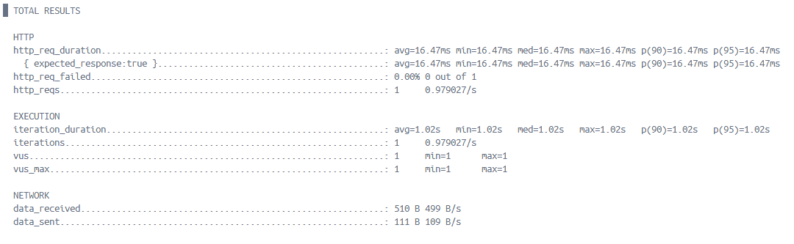
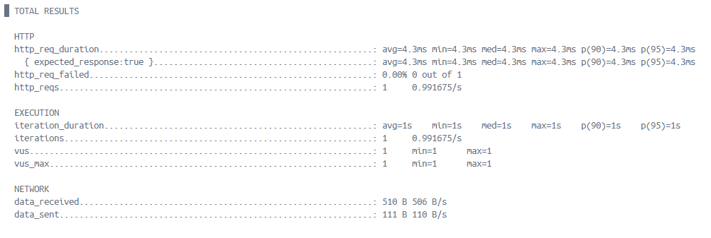
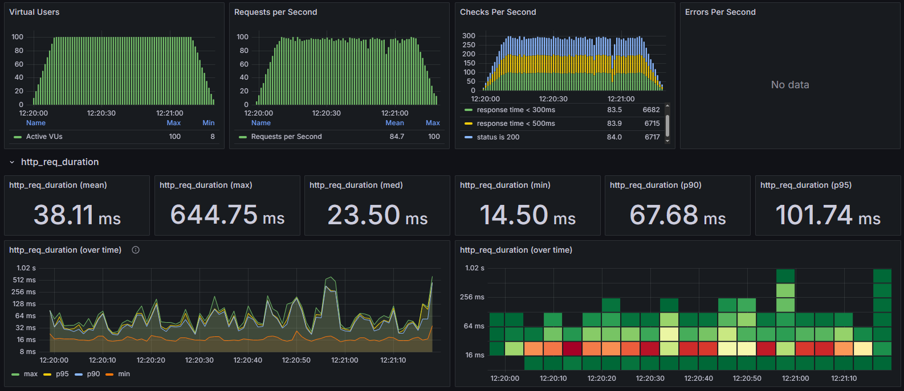
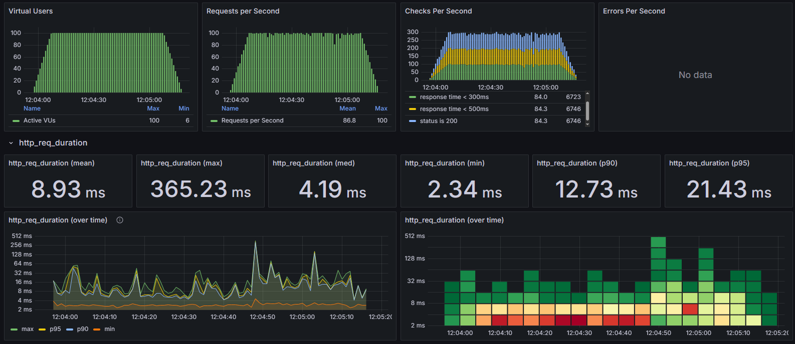

# 캐시 전략 및 성능 향상 보고서

> ### 📑 목차
> - [배경](#배경)
> - [캐시 대상 선정과 캐시 전략](#캐시-대상-선정과-캐시-전략)
>   - [상품 정보 조회](#상품-정보-조회)
>   - [인기 판매 상품 조회](#인기-판매-상품-조회)
> - [캐시 적용 전후 비교를 통한 성능 향상 파악](#캐시-적용-전후-비교를-통한-성능-향상-파악)
>   - [상품 정보 조회 캐시 적용비교](#상품-정보-조회-캐시-적용비교)
>   - [인기 판매 상품 조회 캐시 적용비교](#인기-판매-상품-조회-캐시-적용-비교-)
> - [결론](#결론)

---

## 배경
캐시(Cache)는 자주 사용하는 데이터나 값을 미리 복사해 놓는 임시저장소로, 원본 데이터에 접근하는 비용이 크거나 시간이 오래 걸릴 때, 접근 빈도가 높은 데이터를 캐시에 저장하여 전체 시스템의 성능을 향상시킬 수 있다.

캐시(Cache)는 다음과 같은 상황에 효과적이다.
- 원본 데이터 접근 시간에 비해 캐시 접근 시간이 현저히 빠른 경우 (데이터베이스 쿼리 결과, API 응답 데이터)
- 동일한 요청에 대해 반복적으로 같은 결과를 반환하는 경우 (이미지, 썸네일, 상품 정보)
- 계산 비용이 높은 작업의 결과를 재사용할 필요가 있는 경우 (복잡한 집계 및 통계 데이터)

현재 이커머스 시나리오에서 반복적으로 요청되는 기능들에 대해서 Redis를 활용한 캐시전략을 수립하고 도입한다.   
Redis는 in-memory 데이터 저장소로 빠른 읽기/쓰기와 TTL 기능 등을 지원한다.  
따라서 사용자 응답속도를 개선하며,DB의 부담을 줄일 수 있다.

## 캐시 대상 선정과 캐시 전략

### 상품 정보 조회
보통 상품에 대한 구매결정을 고민을 할때 페이지를 들락날락 하는경우 종종있다.  
이럴때 상품정보를 캐시에 저장해 놓는다면 응답속도가 개선되며, DB의 부담을 줄일 수 있다.  
**Cache Aside** 읽기 전략을 도입하여, 모든 상품이 아닌 필요한 상품에 대한 정보만을 캐시에 저장한다.

### 인기 판매 상품 조회
사용자들은 종종 어떤 상품이 인기있는지 확인하고 구매 결정에 참고한다.  
인기 판매 상품을 계산하는 것은 주문 데이터를 집계하는 복잡한 쿼리가 필요하며, 이는 DB에 상당한 부하를 준다.  
**Refresh Ahead** 캐시 전략을 도입하여, 주기적으로 인기 상품 목록을 미리 계산하여 캐시에 저장해 둔다.  
저장된 캐시를 이용하면 요청 시 즉시 응답할 수 있으며, DB에는 주기적인 쿼리만 수행하면 되므로 부하를 분산시킬 수 있다.

## 캐시 적용 전후 비교를 통한 성능 향상 파악

### 상품 정보 조회 캐시 적용 전후 비교
#### 캐시 적용 전

#### 캐시 적용 후

#### 비교분석
|   측정 지표    | 캐시 적용 전  | 캐시 적용 후  |    성능개선     |
|:----------:|:--------:|:--------:|:-----------:|
|  평균 응답 시간  | 16.47ms  |  4.3ms   | 3.8배 성능 향상  |
| P90 응답 시간  | 16.47ms  |  4.3ms   | 3.8배 성능 향상  |
| P95 응답 시간  | 16.47ms  |  4.3ms   | 3.8배 성능 향상  |
| 처리량(초당 요청) | 0.979027 | 0.991675 | 1.01배 성능 향상 |
- 상품 정보 조회 API의 응답 시간이 약 74% 감소(3.8배 성능 향상)하였다.

### 인기 판매 상품 조회 캐시 적용 비교
#### 캐시 적용 전

#### 캐시 적용 후

#### 비교분석
|     측정 지표      | 캐시 적용 전  | 캐시 적용 후  |    성능개선    |
|:--------------:|:--------:|:--------:|:----------:|
|    평균 응답 시간    | 38.11ms  |  8.93ms  | 4.3배 성능 향상 |
| 중간값(med) 응답 시간 | 23.50ms  |  4.19ms  | 5.6배 성능 향상 |
|   P90 응답 시간    | 67.68ms  | 12.73ms  | 5.3배 성능 향상 |
|   P95 응답 시간    | 101.74ms | 21.43ms  | 4.7배 성능 향상 |
|    최대 응답 시간    | 644.75ms | 365.23ms | 1.8배 성능 향상 |

- 인기 판매 상품 조회 시 응답 시간이 전체적으로 감소한 것을 확인할 수 있다.

## 결론
Redis 기반 캐싱 전략 도입을 통해 전반적인 시스템 성능을 향상시킬 수 있었다.
1. **응답 시간 대폭 개선**
   - 상품 정보 조회: 3.8배 성능 향상 (16.47ms → 4.3ms)
   - 인기 판매 상품 조회: 평균 4.3배 성능 향상 (38.11ms → 8.93ms)
2. **안정적인 응답 시간 보장**
   - P90 / P95와 같은 백분위 응답 시간이 크게 개선되었다.
   - 인기 판매 상품의 경우 P90 응답 시간이 5.3배 개선 (67.68ms → 12.73ms)
3. **데이터베이스 부하 감소**
   - 반복적인 동일 쿼리가 캐시에서 처리되어 DB 서버의 부하 감소
   - 특히 복잡한 집계 쿼리(인기 판매 상품)의 실행 빈도가 크게 줄어듦
