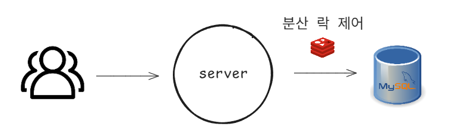
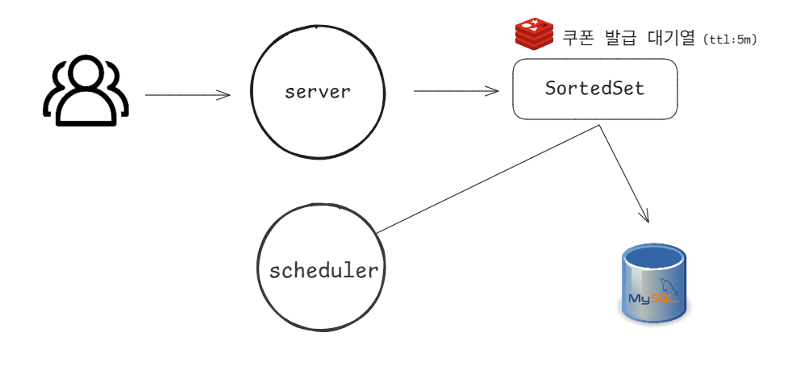
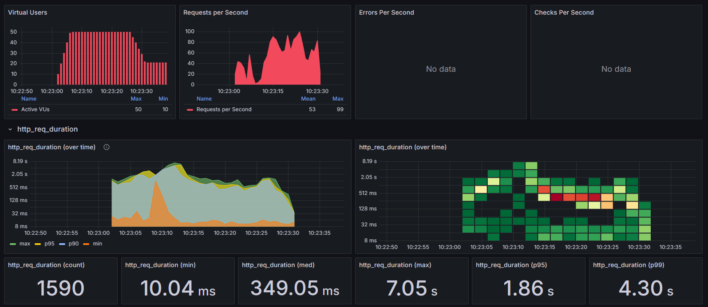
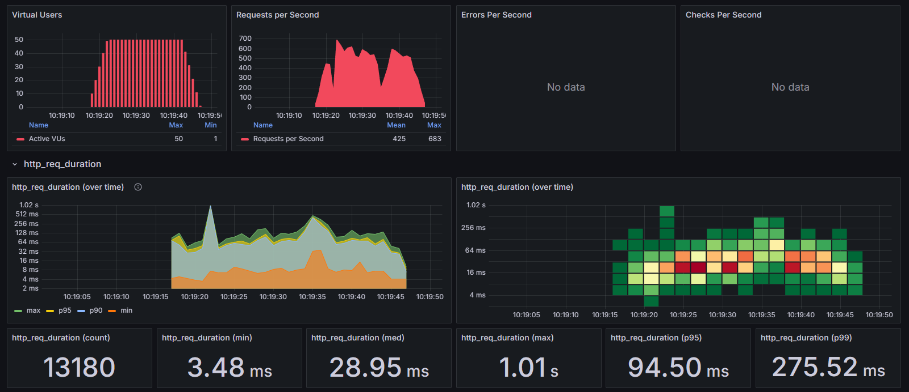

# 선착순 쿠폰 발급 시스템 개선 보고서

> ### 📑 목차
> - [배경](#배경)
> - [문제 해결](#문제-해결)
> - [테스트](#테스트)
> - [한계](#한계)
> - [개선 방향](#개선-방향)
> - [결론](#결론)

---

## 배경
기존의 분산락을 이용한 선착순 쿠폰을 발급하는 상황에서는 대용량 트래픽이 발생하는 경우 아래와 같은 문제가 발생할 수 있다.
- 높은 트래픽 상황에서 읽기/쓰기 작업이 많아 데이터베이스의 부하를 가중시키며 병목 현상 발생할 수 있다.
- 락 획득 과정에서 발생하는 지연으로 사용자 경험 저하될 수 있다.

레디스의 다양한 자료구조 지원과 비동기식으로 대기열의 선착순 쿠폰을 저장함으로써 위의 문제를 해결할 수 있을 것으로 보인다.

## 문제 해결
기존의 아키텍쳐는 다음과 같다.

- 분산 락 제어를 통해 RDB 바로 읽고 쓰는 구조

개선한 아키텍쳐는 다음과 같다.

1. 쿠폰 정보를 캐시에 저장
2. Redis Sorted Set을 활용하여 쿠폰 발급 요청을 시간 순서대로 저장 (대기열, ttl: 5분)
3. 스케줄러(1초 마다 수행)를 통해 캐시의 쿠폰 정보에서의 수량을 확인하여 대기열에서 수량만큼 꺼내서 DB에 저장

## 테스트
선착순 쿠폰을 1000개를 발행하였을때 개선 전/후의 요약결과는 아래와 같다.

기존의 아키텍쳐의 부하테스트는 다음과 같다.

개선한 아키텍쳐의 부하테스트는 다음과 같다.

### 부하 테스트 결과 성능 비교
|        성능 지표        |  개선 전 (RDB + 분산락)  |  개선 후 (Redis + 대기열)  |    개선율    |       비고       |
|:-------------------:|:------------------:|:--------------------:|:---------:|:--------------:|
|    최대 요청량 (RPS)     |         99         |         683          |  590% 증가  |  약 6.9배 성능 향상  |
|    평균 요청량 (RPS)     |         53         |         425          |  702% 증가  |   약 8배 성능 향상   |
|    최소 응답시간 (min)    |      10.04 ms      |       3.48 ms        |  65% 감소   |   약 2.9배 빨라짐   |
|   중앙값 응답시간 (med)    |     349.05 ms      |       28.95 ms       |  92% 감소   |   약 12배 빨라짐    |
|    최대 응답시간 (max)    |       7.05 s       |        1.01 s        |  86% 감소   |    약 7배 빨라짐    |
|  95 백분위 응답시간 (p95)  |       1.86 s       |       94.50 ms       |  95% 감소   |   약 20배 빨라짐    |
|  99 백분위 응답시간 (p99)  |       4.30 s       |      275.52 ms       |  94% 감소   |   약 16배 빨라짐    |
|      총 처리 요청 수      |      1,590 건       |       13,180 건       |  729% 증가  |   약 8.3배 증가    |

1. **처리량(Throughput) 개선**
- 초당 최대 요청 처리량이 99에서 683으로 약 6.9배 증가
- 평균 처리량도 53에서 425로 약 8배 향상

2. **응답 시간(Latency) 개선**
- 중앙값 응답시간이 349.05ms에서 28.95ms로 92% 감소 (약 12배 빨라짐)
- 최대 응답시간이 7.05초에서 1.01초로 대폭 감소
- 특히 95 백분위 응답시간이 1.86초에서 94.50ms로 약 20배 빨라짐

3. **안정성 향상**
- 응답시간 그래프의 변동폭이 줄어들어 더 안정적인 성능 제공
- p99 응답시간이 4.3초에서 275.52ms로 개선되어 최악의 경우에도 성능 보장

4. **확장성 증가**
- 같은 동시 사용자 수(50명)에서 처리 요청 수가 1,590건에서 13,180건으로 약 8.3배 증가
- Redis 기반 대기열 시스템이 효과적으로 부하를 분산시킴

## 한계
- Redis 서버 장애 시 대기열 데이터 손실 가능성이 있다.
- 스케줄러가 단일 인스턴스에서만 실행되는 경우 SPOF(Single Point of Failure) 발생 가능하다.
- 발급 결과를 사용자에게 즉시 알려주지 못하는 비동기 방식의 한계가 있다.

## 개선 방향
- Redis Cluster를 통한 고가용성 확보
- 이벤트 기반 아키텍처 도입으로 쿠폰 발급 결과 알림 시스템 구현
- 분산 스케줄러 도입으로 단일 장애점 제거
- 쿠폰 발급 이력 모니터링 및 분석 기능 강화

## 결론
Redis 기반 대기열과 스케줄러를 활용한 선착순 쿠폰 발급 시스템은 기존 RDB와 분산락 기반 시스템과 비교하여 모든 성능 지표에서 현저한 개선을 보인다.   
특히 응답시간이 전반적으로 크게 단축되어 사용자 경험이 향상되었으며, 시스템의 처리량이 약 8배 증가하여 동일한 하드웨어로 더 많은 요청을 처리할 수 있게 되었다.   
응답시간의 편차가 줄어든 것은 시스템의 안정성과 예측 가능성이 높아졌음을 의미한다.  
이러한 성능 개선은 대규모 트래픽 상황에서도 안정적인 서비스를 제공할 수 있게 되었다.
