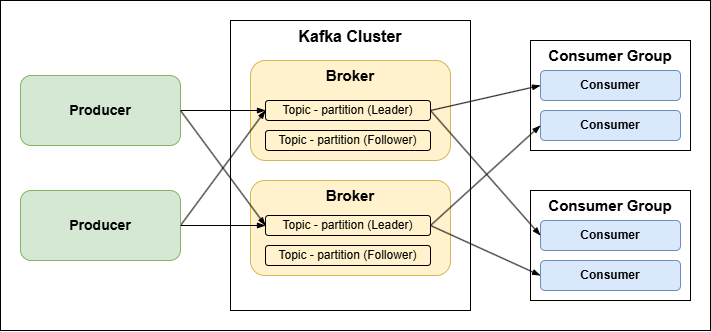
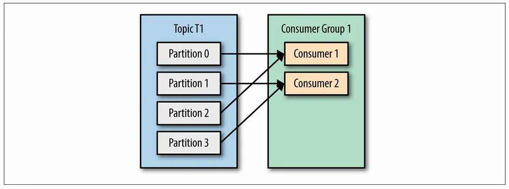
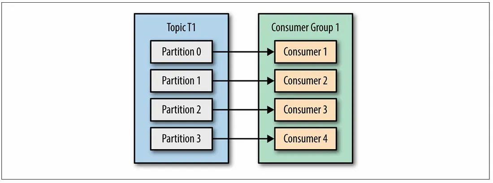
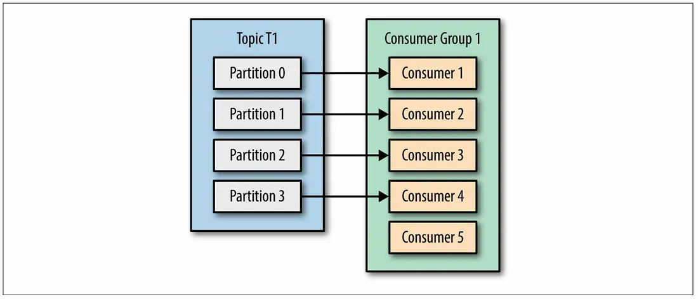

# Apache Kafka 기초 학습 문서

## 개요
Kafka는 오픈 소스 분산 이벤트 스트리밍 플랫폼으로, 고성능 데이터 파이프라인, 스트리밍 분석, 데이터 통합 등을 위해 수 많은 기업에서 사용하고 있다.
kafka는 데이터를 안전하고 효율적으로 전송하기 위한 메시지 시스템으로 높은 처리량과 낮은 지연시간을 제공하며, 실시간 데이터 스트리밍에 특화되어 있다.

## 구성요소

### Producer
**카프카 토픽에 메시지를 발행하는 클라이언트**
- 특정 토픽의 파티션으로 메시지를 발행한다.
- 키가 없는 경우 라운드 로빈 방식으로 파티션에 분배된다.
- 키가 있는 경우 키의 해시값을 기반으로 동일한 파티션에 전송된다.
- acks 설정으로 메시지 전송 보장 수준을 조정할 수 있다.

### Broker
**카프카 클러스터를 구성하는 개별 서버**
- 카프카 클러스터는 하나 이상의 브로커로 구성된다.
- 각 브로커는 고유한 ID를 가지며 토픽의 파티션들을 저장한다.
- 클라이언트의 읽기/쓰기 요청을 처리한다.
- 파티션의 리더 또는 팔로워 역할을 수행한다.

### Consumer
**카프카 토픽에서 메시지를 읽어오는 클라이언트**
- 하나 이상의 토픽을 구독하여 메시지를 소비한다.
- 컨슈머 그룹을 통해 부하 분산과 장애 복구를 지원한다.
- 오프셋을 관리하여 메시지 처리 위치를 추적한다.
- 자동 커밋 또는 수동 커밋으로 오프셋을 관리할 수 있다.

### Topic
**메시지를 구분하는 논리적 단위**
- 메시지 스트림의 카테고리 또는 피드 이름을 나타낸다.
- 하나의 토픽은 여러 개의 파티션으로 구성된다.
- 프로듀서는 토픽에 메시지를 발행하고, 컨슈머는 토픽을 구독한다.
- 토픽별로 보존 기간과 복제 팩터를 설정할 수 있다.

### Partition
**토픽을 물리적으로 분할한 단위**
- 순서가 보장되는 불변의 레코드 시퀀스이다.
- 각 메시지는 파티션 내에서 오프셋이라는 고유한 순차 ID를 갖는다.
- 파티션 내에서만 메시지 순서가 보장된다.
- 병렬 처리를 위한 확장성을 제공한다.

### Consumer Group (컨슈머 그룹)
**동일한 group.id를 가진 컨슈머들의 집합**
- 토픽의 파티션들을 그룹 내 컨슈머들에게 분배한다.
- 하나의 파티션은 그룹 내 하나의 컨슈머에만 할당된다.
- 컨슈머가 추가/제거되면 자동으로 파티션이 재할당된다.
- 서로 다른 컨슈머 그룹은 동일한 메시지를 독립적으로 소비한다.

### Offset
**파티션 내에서 각 메시지의 고유한 순차 ID**
- 컨슈머가 어디까지 읽었는지 오프셋을 추적한다.
- 0부터 숫자가 시작되며, 순차적으로 증가한다.
- 오프셋 리셋 정책으로 처리 시작 위치를 결정할 수 있다.

### Replication
**데이터의 안정성과 가용성을 위한 메커니즘**
- 각 파티션은 하나의 리더와 여러 팔로워 복제본을 갖는다.

### ISR (In-Sync Replicas)
**Leader와 동기화 상태를 유지하는 Replica들의 집합**
- 데이터 일관성과 고가용성의 핵심 메커니즘이다.
- 리더가 장애가 발생했을때 ISR 중에서 새로운 리더가 후보가 된다.

### Lag
- **Producer가 전송한 메시지와 Consumer가 처리한 메시지 간의 차이**

### ACK (Acknowledgment)
**프로듀서가 메시지 전송 성공을 확인받는 메커니즘**
- `acks=0`: 전송 후 응답 대기하지 않음 (최고 성능, 최저 안정성)
- `acks=1`: Leader Broker만 응답 대기 (기본값)
- `acks=all` 또는 `acks=-1`: 모든 Replica 응답 대기 (최고 안정성)

### Retention (보존 정책)
**메시지를 얼마나 보관할지 결정하는 정책**
- 설정 단위는 시간, 파티션 크기로 결정할 수 있다.

### Rebalancing
**컨슈머 그룹 내에서 파티션 할당을 재조정하는 프로세스**
- 컨슈머가 추가되거나 제거될 때 자동으로 발생한다.
- 구독하는 토픽의 파티션이 변경될 때 트리거된다.
- 컨슈머가 장애로 인해 세션 타임아웃될 때 시작된다.
- 리밸런싱 중에는 전체 컨슈머 그룹이 일시적으로 메시지 처리를 중단한다.

## 데이터 흐름

### 기본 흐름
1. Producer → Topic/Partition → Consumer
2. Producer가 메시지를 특정 Topic의 Partition으로 전송한다.
3. Consumer가 해당 Partition에서 메시지를 순차적으로 읽어온다.

### Partition 수 > Consumer 수

- 4개의 파티션을 2개의 컨슈머가 처리한다.
- 각 컨슈머가 여러 파티션을 처리하므로 Lag이 발생할 수 있다.
- Lag이 발생하면서 처리속도가 자연스럽게 느려진다. (쓰로틀링으로 활용할 수 있다.)
- 하나의 컨슈머가 장애가 발생할 경우 리밸런싱이 동작하며, 남은 컨슈머가 4개의 파티션을 처리해야 하면서 부하가 증가된다.
- 처리속도를 개선하고자 한다면, 컨슈머를 2개 더 추가하여 파티션수와 컨슈머수를 1:1로 맞춘다.

#### Partition 수 = Consumer 수

- 파티션 수와 컨슈머의 수가 1:1로 각 컨슈머가 하나의 파티션만 전담하고 있다.
- 균등한 부하 분산으로 각 파티션별 처리속도를 보장한다.
- 하나의 컨슈머가 장애가 발생할 경우 영향을 최소화할 수 있다. 

#### Partition 수 < Consumer 수

- 4개의 파티션을 4개의 컨슈머가 처리하여 처리속도를 보장한다.
- 컨슈머 1개가 남게 되면서 리소스가 낭비된다.
- 리밸런싱하게 될 경우 오버헤드만 증가한다.