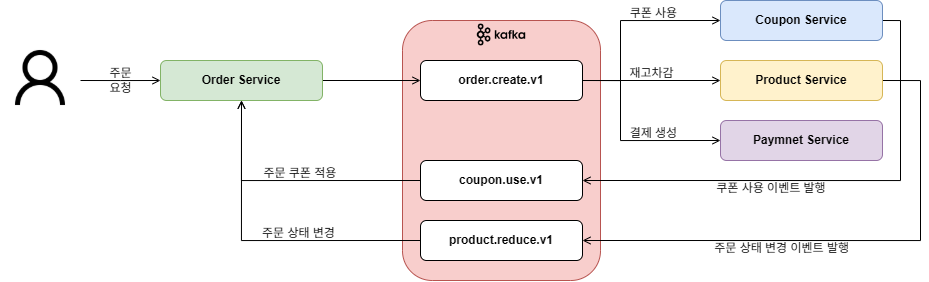
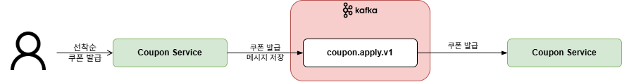

# Kafka 기반 아키텍처로의 변경 설계서

## 배경
기존의 E-Commerce의 주문 프로세스는 Spring Event를 활용한 동기식 이벤트 처리를 하고 있었으며, 선착순 쿠폰 발급은 Redis에 대기열로 저장하고 스케줄러를 통해 발급을 하고 있었다. 

주문이 생성되면 쿠폰 사용, 재고 차감, 결제 정보 저장 등의 작업이 모두 동기적으로 처리되고 있다. 
이 과정 중 하나라도 실패하면 전체 주문 프로세스가 실패하게 되는데, 이는 논리적인 의존이 존재하며 서비스 간의 결합도가 높다.

Kafka를 통해 메시지 처리를 비동기식으로 처리하고, 각 서비스는 독립적으로 메시지를 소비하고 처리한다. 
서비스는 이벤트만 소비함으로써 서비스 간의 결합도를 낮추고, 각 서비스는 목적에 집중하여 강한 응집을 갖는 시스템으로 변경하고자 한다.

## 진행 과정
### Topic 설계
```java
@Configuration
public class KafkaTopicConfig {

    @Bean
    public NewTopic couponApplyTopic() {
        return TopicBuilder.name(EventType.Topic.COUPON_APPLY)
                .partitions(4)
                .replicas(1)
                .build();
    }
    ...
}
```
- 토픽을 4개의 파티션으로 분할하여 메시지를 분산 저장한다.
- 애플리케이션 실행 시 자동으로 토픽이 생성된다.
- replica를 1개로 설정하여 단일 브로커 환경으로 설정하였다.

### Producer 구현
```java
public interface CouponEventPublisher {
    void publish(CouponEvent.Apply event);
    ...
}
```
```java
@Component
@RequiredArgsConstructor
public class CouponEventPublisherImpl implements CouponEventPublisher {

    private final CouponEventProducer producer;

    @Override
    public void publish(CouponEvent.Apply event) {
        producer.send(event);
    }
    ...
}
```
```java
@Component
@RequiredArgsConstructor
public class CouponEventProducer {

    private final KafkaTemplate<String, Object> kafkaTemplate;

    public void send(CouponEvent.Apply event) {
        kafkaTemplate.send(EventType.Topic.COUPON_APPLY, event.couponId().toString(), event);
    }
    ...
}
```

### Consumer 구현
```java
@KafkaListener(topics = EventType.Topic.XXX, groupId = EventType.GroupId.XXX, concurrency = "4")
public void handleCouponIssueEvent(CouponEvent.Apply command, Acknowledgment ack) { 
    ...
}
```
```yml
spring:
  kafka:
    listener:
      ack-mode: manual
```
- 토픽을 구독하고, 서비스기반으로 컨슈머 그룹을 형성하였다.
- `concurrency`를 파티션과 동일하게 맞추어 병렬로 처리되도록 하였다.
- `ack-mode: manual` 설정하여 메시지를 처리한 후 수동으로 오프셋을 커밋하여 메시지 손실을 방지하였다.

## Event를 Kafka로 변경 (주문)

### 데이터 흐름

### 장단점
- 이전의 Spring Event를 Kafka로 변경하면서 분산처리가 가능해졌다. 또한, 시스템의 확장에 자유로워졌다.
- kafka는 메시지가 디스크에 저장되어 장애가 발생하여도 데이터를 보존하고 있어 복구가 가능하다.
- 비동기 통신으로 독립성과 시스템간의 느슨한 결합을 확보할 수 있다.
- 관리대상이 늘어 개발과 운영의 복잡도가 증가하였다.
- 네트워크 통신으로 인한 지연시간이 증가하였다.

## Redis 저장소를 Kafka로 변경 (선착순 쿠폰 발급)

### 데이터 흐름

### 장단점
- 기존에는 redis에 저장하고 스케줄러를 통해 쿠폰발급이 이루어졌지만, kafka를 이용하면서 단순히 이벤트를 발행함으로써 처리량이 증가하였다.
- redis는 in-memory 기반으로 데이터가 유실될 수 우려가 있지만, kafka를 이용하면 디스크에 저장하므로 유실 우려가 적다.
- 단일 파티션 사용 시 병목현상이 발생하여 발급처리의 속도 느릴 수 있으며, 이로 인해 실시간성이 저하될 수 있다.

## 결론
E-Commerce 시스템에 Kafka를 적용하면서 기존의 동기 처리 구조에서 발생하던 서비스 간 결합도를 낮추고, 확장성을 높일 수 있었다.

Kafka를 도입함으로써 다음과 같은 주요 효과를 기대할 수 있다.
- 이벤트 발행과 소비를 분리하여 각 서비스는 관심 있는 이벤트만 처리함으로써 서비스 간 의존성을 낮추고, 독립성을 확보할 수 있다.
- Kafka의 파티셔닝을 통해 이벤트 처리를 병렬화함으로써 대량의 트래픽에도 유연하게 대응할 수 있다.
- kafka는 디스크 기반 메시지 저장 구조로 장애 발생 시에 데이터 유실 없이 재처리가 가능하다.

하지만 Kafka 도입은 다음과 같은 과제를 동반한다.
- Kafka 클러스터 관리, 메시지 관리, 장애 복구 등 고려해야 할 운영 요소가 증가하였다.
- 비동기 구조 특성상 즉각적인 응답보다는 처리 완료까지의 시간 지연이 발생할 수 있다.
