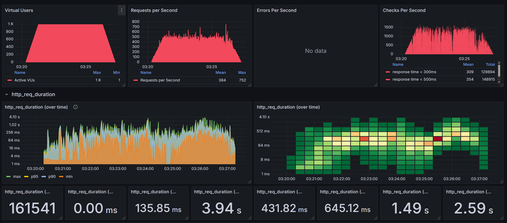
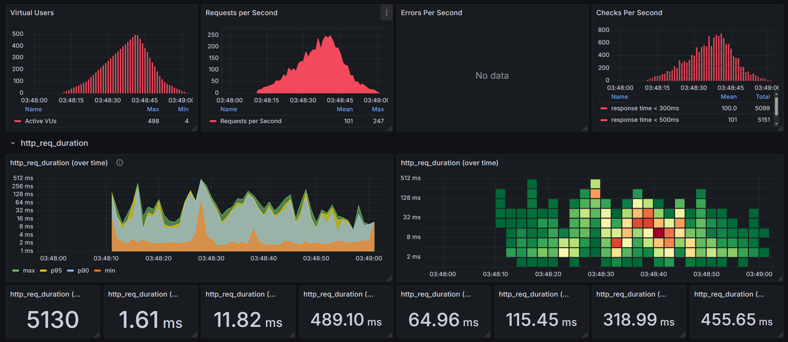

# E-COMMERCE 부하 테스트 보고서

## 배경 및 목적
이커머스 서비스는 특정 이벤트 기간 동안 쿠폰 발급, 상품 조회, 주문 등이 동시다발적으로 발생하면서 트래픽이 급증할 수 있다. 
이로 인해 서버 과부하가 발생하면서 가용성이 저하되고, 서비스 신뢰도에 감소시킬 수 있다.
또한 사용자 경험이 악화되며서 매출 감소와 같이 부정적인 결과를 초래할 수 있다. 
따라서 이벤트성 서비스를 배포 전에는 시스템의 안정성과 데이터 정합성을 반드시 검증해야 한다.

## 테스트 API 선정
### 인기상품 조회 API
- **[GET] /api/v1/products/best**
- **선정 근거**
  - 이벤트 기간 동안 많은 사람들이 많이 팔린 상품은 무엇인지 자연스럽게 찾아본다.
  - 파레토 법칙에 따르면 20% 의 상품이 80% 매출을 이끌어 내어 많은 주문을 유도하게 될 것이다.

### 선착순 쿠폰 발급 API
- **[POST] /api/v1/coupon/issue**
- **선정 근거**
  - 이벤트 기간에는 보통 팝업이나 배너로 쿠폰 발급을 안내한다. 
  - 선착순 쿠폰 발급은 일반적인 쿠폰보다 혜택이 더 좋기 때문에 일반적인 사람이라면 먼저 발급 요청을 하게 될 것으로 예상되며 트래픽이 집중될것으로 예상된다. 

## 테스트 환경
- 테스트 환경은 Docker 리소스 동적 할당하여 실행하였다.
  - CPU: Docker Custom(2 Core)
  - RAM: 4GB
```docker-compose.yml
services:
  e-commerce-service:
    build:
      context: .
      dockerfile: Dockerfile
    container_name: e-commerce-service
    ports:
      - "8080:8080"
    environment:
      TZ: Asia/Seoul
      SPRING_KAFKA_BOOTSTRAP_SERVERS: kafka:9092
    depends_on:
      - mysql
      - kafka
      - redis
    deploy:
      resources:
        limits:
          cpus: '2'
          memory: 4GB
  ...
```

## 테스트 설계

### 테스트 데이터 준비
- **상품**: 1000개 상품, 각 상품당 10개 옵션 (총 10,000개 옵션)
- **쿠폰**: 5종류, 각 쿠폰당 발급 가능 수량 1000개

### 인기상품 조회 API
- 동시 사용자: 1,000명
- 테스트 시간: 7분
- 테스트 방식: 부하테스트

### 선착순 쿠폰 발급 API
- 동시 사용자: 100명 → 500명
- 테스트 시간: 1분
- 요청 패턴: 스파이크 테스트

## 테스트 실행 및 결과 분석

### 인기상품 조회 API


### 선착순 쿠폰 발급 API


## 결과 분석

### 인기상품 조회 API 분석

|   구분   |   응답시간   |
|:------:|:--------:|
|  min   |  0.00ms  |
| median | 135.85ms |  
|  p90   |  3.94s   |
|  p95   | 431.82ms |
|  p99   |  1.49s   |
|  max   |  2.59s   |
- **처리량**: 평균 384 RPS, 최대 752 RPS
- **에러율**: 0 
- **분석**
  - 중간값과 p90 사이의 격차가 크게 발생 (135ms → 3.94s)
  - p90 응답시간이 3.94초인 구간이 존재하며 사용자 경험이 저하될 우혀가 있다. 

### 선착순 쿠폰 발급 API 분석
|   구분   |   응답시간   |
|:------:|:--------:|
|  min   |  1.61ms  |
| median | 11.82ms  |
|  p90   | 489.10ms |
|  p95   | 64.96ms  |
|  p99   | 318.99ms |
|  max   | 455.65ms |
- **처리량**: 평균 101 RPS, 최대 247 RPS
- **에러율**: 0 (에러 데이터 없음)
- **분석**
  - 500명 미만의 동시 접속에서는 안정적인 성능
  - p90-p95 구간에서 응답시간 변동성이 큼
  - 최대 응답시간이 455ms로 양호한 수준

## 결론
리소스를 제한하였을때 트래픽이 집중되는 경우에는 캐시를 적용했음에도 불구하고 p90에서 3.94초라는 긴 응답시간으로 현저히 떨어지는 모습을 보였다. 
이러한 부분은 사용자 경험에 저하를 유발하고, 서비스의 신뢰도가 떨어지며, 매출감소의 부정적인 결과를 초래할 수 있다.
다만, 선착순 쿠폰발급은 대기열로 처리하여 비록 500명 이하에서 테스트진행하여 최대 응답시간이 455ms로 안정적인 모습을 보였다
향후 더 높은 부하에서의 추가 테스트가 필요할 것으로 보인다.
