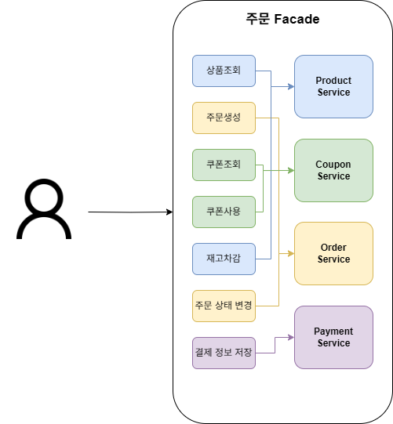
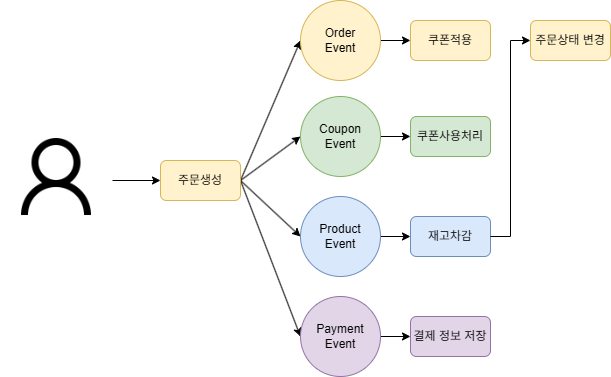

# MSA 전환에 따른 도메인 분리 및 트랜잭션 처리 설계
msa 전환과 트랜잭션 설게
## 1. 서비스 규모 확장에 따른 MSA 도입 배경
E-Commerce 시스템은 단일 애플리케이션으로 구성된 모놀리식 아키텍처로 개발되었으며, 수요와 트래픽이 증가함에 따라 마이크로 서비스로의 전환은 필수적이다.
기존 모놀리식 아키텍쳐를 그대로 사용한다면 다음과 같은 한계에 직면할 수 있다.
- 특정 도메인(상품 조회)의 트래픽이 증가해도 전체 시스템을 확장해야 한다.
- 작은 변경사항도 전체 시스템 재배포 필요하다.
- 한 도메인의 장애가 전체 시스템에 영향을 끼쳐 장애가 전파된다.

## 2. 도메인별 배포 단위 설계
### 2.1 도메인 경계 설정
#### User Service (사용자 서비스)
- **도메인**: User
- **책임**: 사용자 정보 관리, 인증/인가
#### Product Service (상품 서비스)
- **도메인**: Product, ProductOption
- **책임**: 상품 정보 관리, 재고 관리
#### Order Service (주문 서비스)
- **도메인**: Order, OrderItem
- **책임**: 주문 생성 및 상태 관리
#### Payment Service (결제 서비스)
- **도메인**: Payment
- **책임**: 결제 처리, 외부 PG 연동
#### Coupon Service (쿠폰 서비스)
- **도메인**: Coupon, IssuedCoupon
- **책임**: 쿠폰 발급 및 사용 관리
#### Balance Service (잔액 서비스)
- **도메인**: Balance, BalanceHistory
- **책임**: 사용자 잔액 관리, 충전/차감

## 3. 트랜잭션 처리의 한계
### 3.1 기존 모놀리식 트랜잭션


현재 OrderFacade에서 주문 처리 시 하나의 트랜잭션으로 처리한다.
```java
@Transactional
public OrderResult.Create order(OrderCriteria.Create criteria) {
    // 1. 상품 조회
    ProductInfo.ProductAggregate product = productService.findProduct(...);
    
    // 2. 주문 생성
    OrderInfo.Create order = orderService.createOrder(...);
    
    // 3. 쿠폰 사용
    CouponInfo.CouponAggregate couponInfo = couponService.use(...);
    
    // 4. 재고 차감
    ProductInfo.Order reducedProduct = productService.reduceStock(...);
    
    // 5. 결제 정보 저장
    paymentService.save(...);
}
```

### 3.2 분산 환경에서의 문제점
MSA로 분리 시 각 서비스가 독립적인 데이터베이스를 가지므로 전통적인 ACID 트랜잭션이 불가하며, 원자성을 보장할 수 없다. 
또한 일부 서비스만 성공하고 일부는 실패하는 상황이 발생할 수 있어, 보상 트랜잭션과 같이 원자성을 맞추기 위한 작업이 추가되므로 구현 난이도가 증가하게 된다.

## 4. 해결방안
### 4.1 이벤트 기반 아키텍처 도입


분산 트랜잭션 문제를 해결하기 위해 이벤트 기반의 Saga 패턴을 적용한다. 기존 Facade 패턴에서 각 서비스가 이벤트를 통해 느슨하게 결합되는 구조로 전환한다.

### 4.2 Choreography Saga 구현

각 서비스가 자율적으로 이벤트를 발행하고 구독하는 방식으로 구현한다

**OrderEventPublisher.java**
```java
@Component
@RequiredArgsConstructor
public class OrderEventPublisher {
    private final ApplicationEventPublisher publisher;
    
    public void publishOrderCreateEvent(OrderEvent.OrderCreate event) {
        log.info("주문 생성 이벤트 발행 : {}", event);
        publisher.publishEvent(event);
    }
}
```

**CouponEventListener.java**
```java
@Component
@RequiredArgsConstructor
public class CouponEventListener {
    private final CouponService couponService;
    
    @TransactionalEventListener(phase = TransactionPhase.AFTER_COMMIT)
    public void handleOrderCreateEvent(OrderEvent.OrderCreate event) {
        if (event.couponId() != null) {
            couponService.use(new CouponCommand.Use(
                event.userId(), 
                event.couponId()
            ));
        }
    }
}
```

### 4.3 보상 트랜잭션

실패 시 이전 단계를 복구하는 보상 트랜잭션 구현이 필요하다. 현재는 `@TransactionalEventListener(phase = TransactionPhase.BEFORE_COMMIT)`를 사용하여 처리하였으며, 추후 완전한 보상 트랜잭션 메커니즘을 구현할 예정이다.

```java
// OrderEventListener.java - 재고 부족 시 주문 보류
@TransactionalEventListener(phase = TransactionPhase.BEFORE_COMMIT)
public void handleHoldOrderEvent(ProductEvent.ReduceStock event) {
    orderService.holdOrders(
        new OrderCommand.handleOrders(
            event.orderId(),
            event.optionDetails()
        )
    );
}
```

## 5. MSA와 이벤트 드리븐 아키텍처(EDA)의 필요성

MSA의 도입은 서비스를 개별적으로 확장할 수 있어, 필요한 경우에만 확장하면서 리소스의 효율성을 극대화할 수 있다.
또한, 각 서비스에 맞는 기술스택을 선택할 수 있으며, 서비스별 독리적인 운영이 가능하다.

이벤트 드리븐 아키텍처(EDA)는 MSA 환경에서 서비스 간 통신의 복잡성을 해결하는 핵심 패턴이다.
EDA는 느슨한 결합을 실현할 수 있어 시스템의 확장성을 높일 수 있다. 또한 이벤트 큐를 통해 부하를 효과적으로 분산킬 수 있어 부하에 따라 서비스를 독립적으로 확장할 수 있다.

## 6. 결론
도메인별로 명확한 경계를 설정하여 독립적인 서비스로 분리하고, 분산 트랜잭션의 한계는 이벤트 기반 Saga 패턴을 통해 해결할 수 있다.  
MSA는 각 서비스의 독립적인 확장과 배포를 가능하게 하며, EDA는 서비스 간 느슨한 결합과 높은 복원력을 제공한다. 이 두 아키텍처 패턴의 결합은 확장 가능하고 유연하며 장애에 강한 시스템을 구축할 수 있게 한다.
최종적으로는 비즈니스 요구사항에 신속하게 대응할 수 있는 시스템 아키텍처를 구현할 수 있을 것이다.
