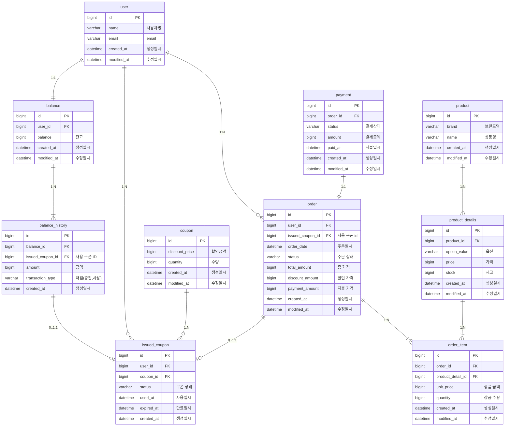

```mermaid
erDiagram
  user ||--|| balance: "1:1"
  balance ||--|{ balance_history: "1:N"
  balance_history ||--o| issued_coupon: "0..1:1"
  user ||--o{ issued_coupon: "1:N"
  coupon ||--o{ issued_coupon: "1:N"
  product ||--|{ product_details: "1:N"
  user ||--o{ order: "1:N"
  order ||--|{ order_item: "1:N"
  order ||--o| issued_coupon: "0..1:1"
  product_details ||--|{ order_item: "1:N"
  payment ||--||order : "1:1"

  user {
    bigint id PK
    varchar name "사용자명"
    varchar email "email"
    datetime created_at "생성일시"
    datetime modified_at "수정일시"
  }

  balance {
    bigint id PK
    bigint user_id FK
    bigint balance "잔고"
    datetime created_at "생성일시"
    datetime modified_at "수정일시"
  }

  balance_history {
    bigint id PK
    bigint balance_id FK
    bigint issued_coupon_id FK "사용 쿠폰 ID"
    bigint amount "금액"
    varchar transaction_type "타입(충전,사용)"
    datetime created_at "생성일시"
  }

  coupon {
    bigint id PK
    bigint discount_price "할인금액"
    bigint quantity "수량"
    datetime created_at "생성일시"
    datetime modified_at "수정일시"
  }

  issued_coupon {
    bigint id PK
    bigint user_id FK
    bigint coupon_id FK
    varchar status "쿠폰 상태"
    datetime used_at "사용일시"
    datetime expired_at "만료일시"
    datetime created_at "생성일시"
  }

  product {
    bigint id PK
    varchar brand "브랜드명"
    varchar name "상품명"
    datetime created_at "생성일시"
    datetime modified_at "수정일시"
  }

  product_details {
    bigint id PK
    bigint product_id FK
    varchar option_value "옵션"
    bigint price "가격"
    bigint stock "재고"
    datetime created_at "생성일시"
    datetime modified_at "수정일시"
  }

  
  order {
    bigint id PK
    bigint user_id FK
    bigint issued_coupon_id FK "사용 쿠폰 id"
    datetime order_date "주문일시"
    varchar status "주문 상태"
    bigint total_amount "총 가격"
    bigint discount_amount "할인 가격"
    bigint payment_amount "지불 가격"
    datetime created_at "생성일시"
    datetime modified_at "수정일시"
  }
  
  order_item {
    bigint id PK
    bigint order_id FK
    bigint product_detail_id FK
    bigint unit_price "상품 금액"
    bigint quantity "상품 수량"
    datetime created_at "생성일시"
    datetime modified_at "수정일시"
  }
  
  payment {
    bigint id PK
    bigint order_id FK
    varchar status "결제상태"
    bigint amount "결제금액"
    datetime paid_at "지불일시"
    datetime created_at "생성일시"
    datetime modified_at "수정일시"
  }

```
