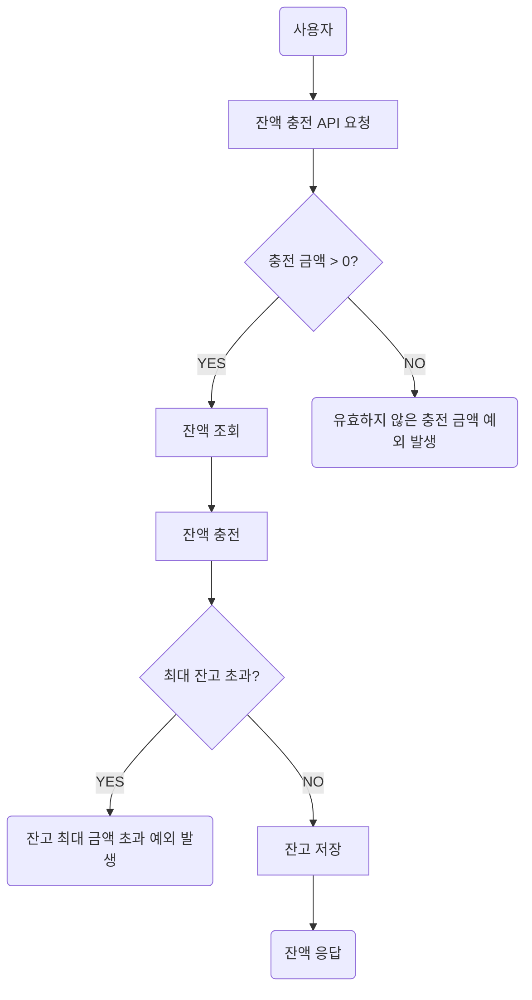
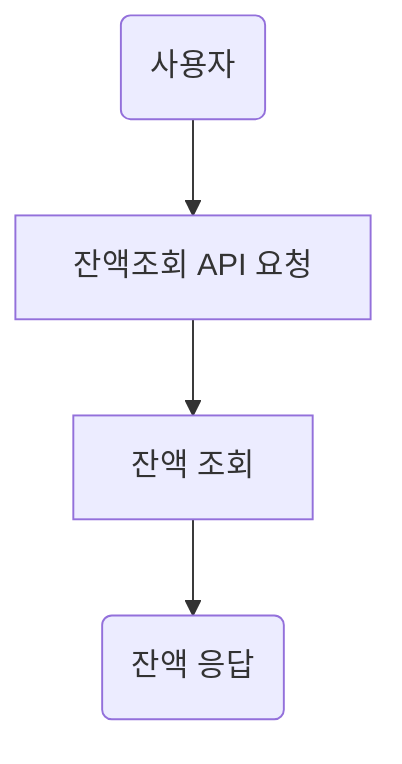
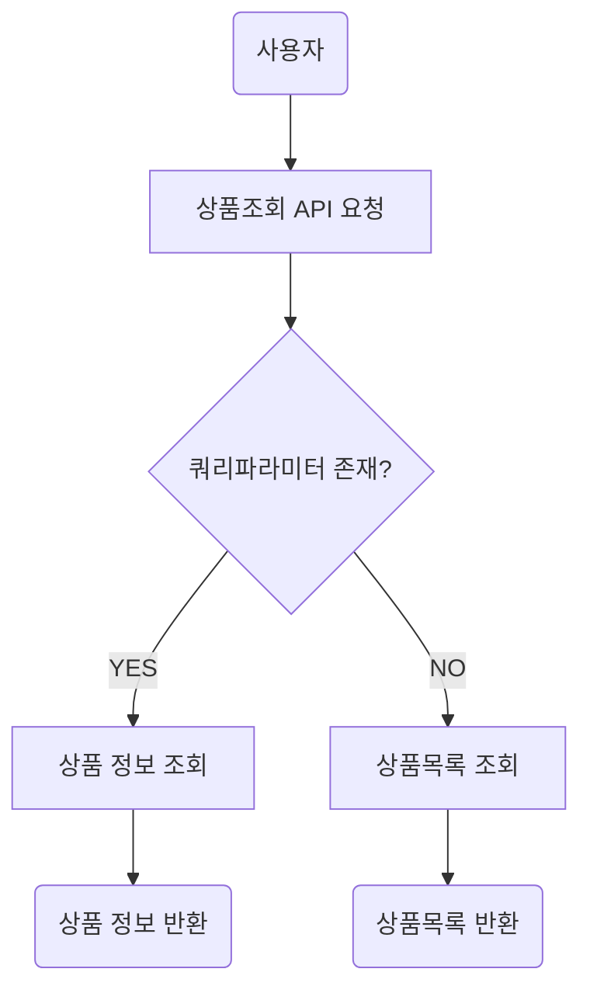
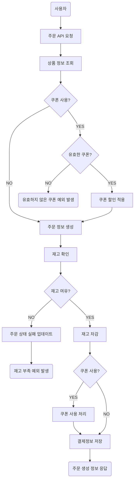
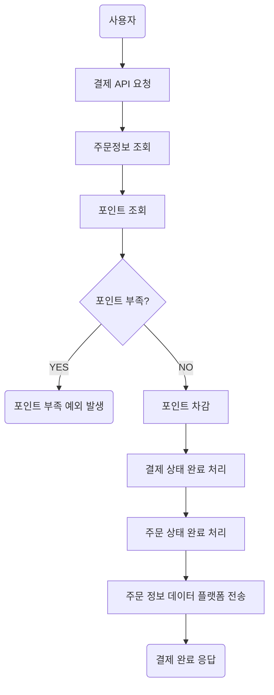
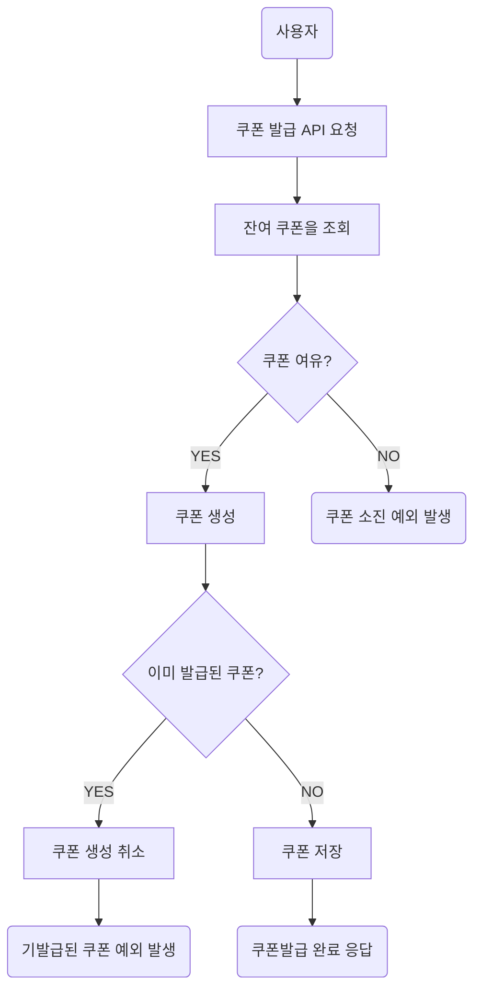
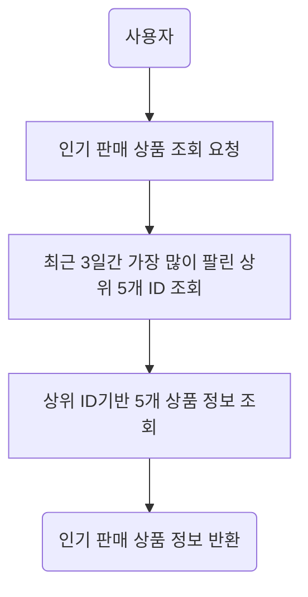

## [요구사항 분석] Flowchart

> ### 📑 목차
> - [잔액 충전 API](#잔액-충전-api)
> - [잔액 조회 API](#잔액-조회-api)
> - [상품 조회 API](#상품-조회-api)
> - [주문 API](#주문-api)
> - [결제 API](#결제-api)
> - [선착순 쿠폰 API](#선착순-쿠폰-api)
> - [인기 판매 상품 조회 API](#인기-판매-상품-조회-api)
---

### 잔액 충전 API

---

### 잔액 조회 API

---

### 상품 조회 API

---

### 주문 API

---

### 결제 API

---

### 선착순 쿠폰 API

---

### 인기 판매 상품 조회 API

